# Movie Explorer

Uses the [TMDB API](https://www.themoviedb.org/documentation/api).

Url: https://gracious-stonebraker-94dc28.netlify.app/

Requires authentication from TMDB to check your watchlist and add/remove movies from the watchlist.

Uses [Snowpack](https://www.snowpack.dev/) as the underlying web framework. Full SPA with React, Redux and TypeScript.

## Screenshots

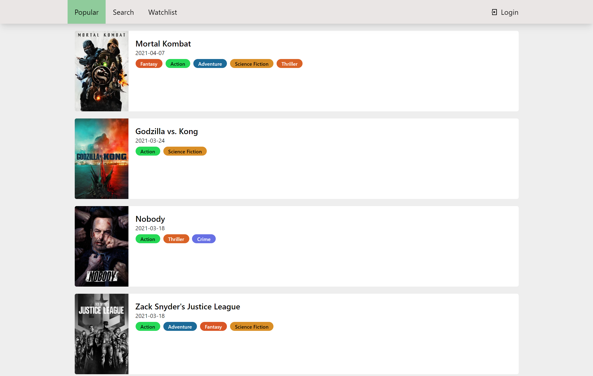
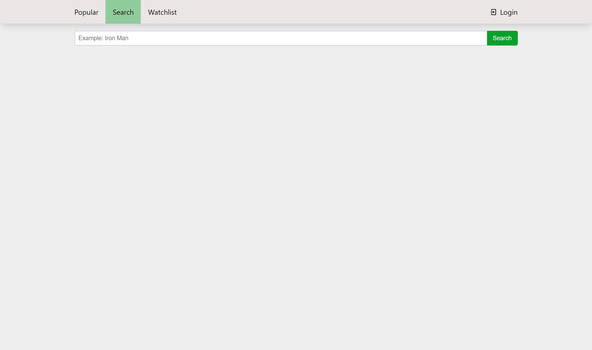
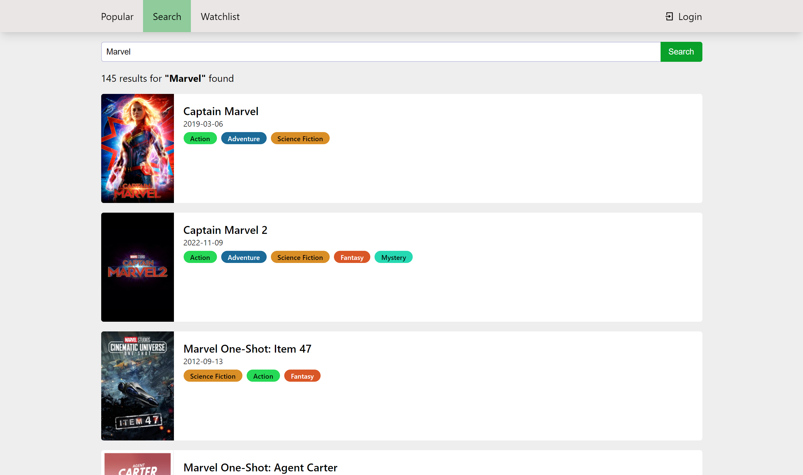
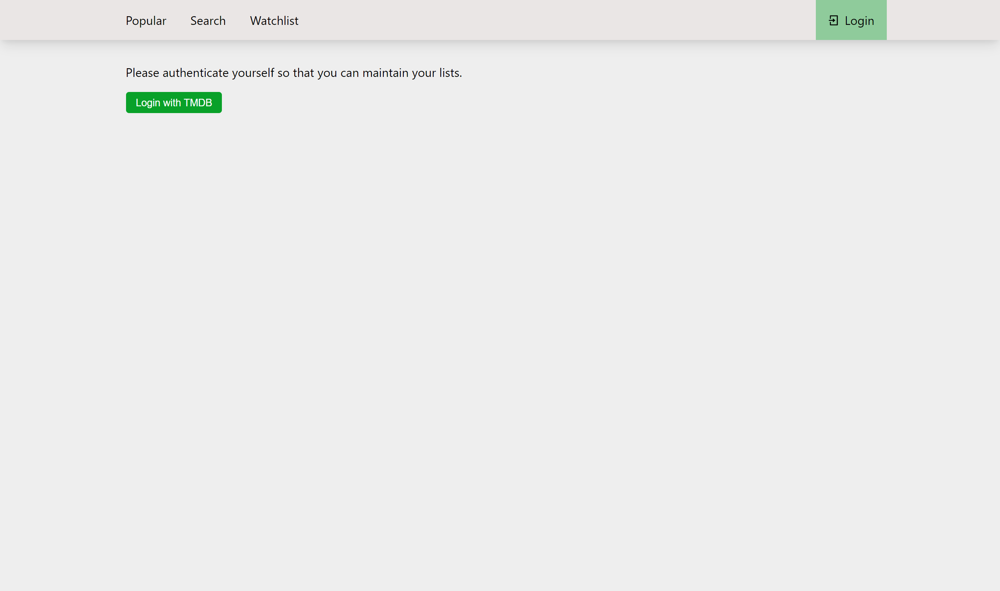
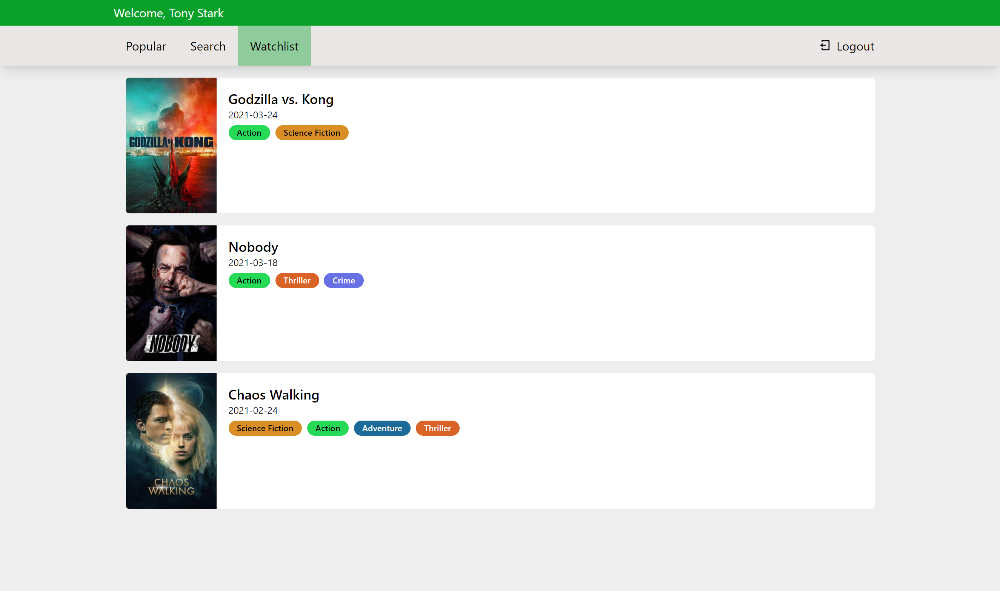
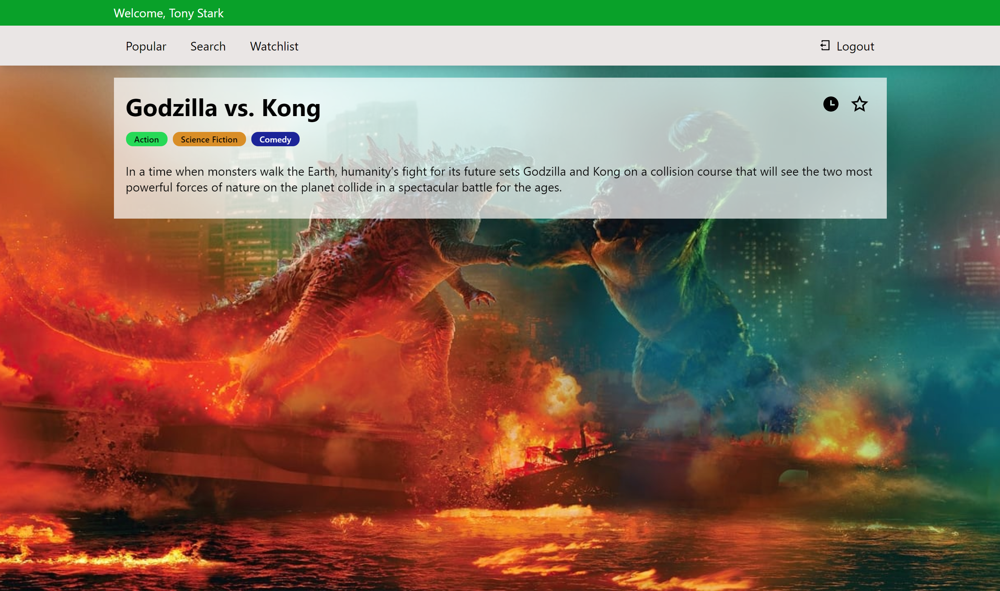

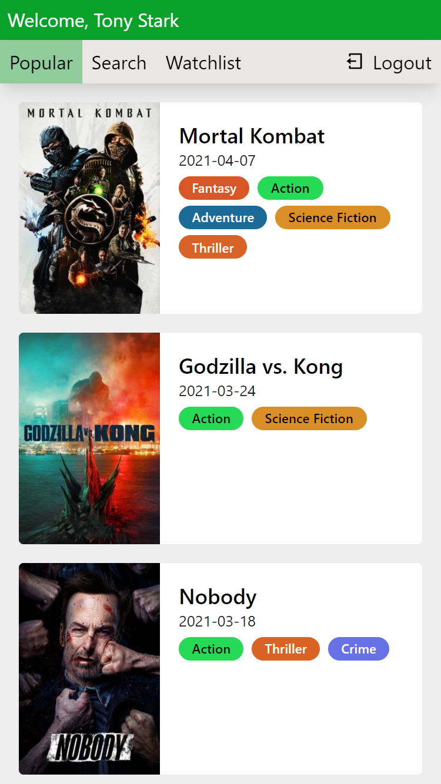
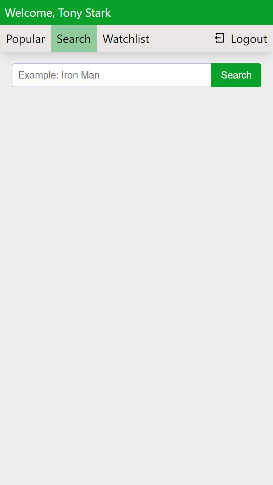
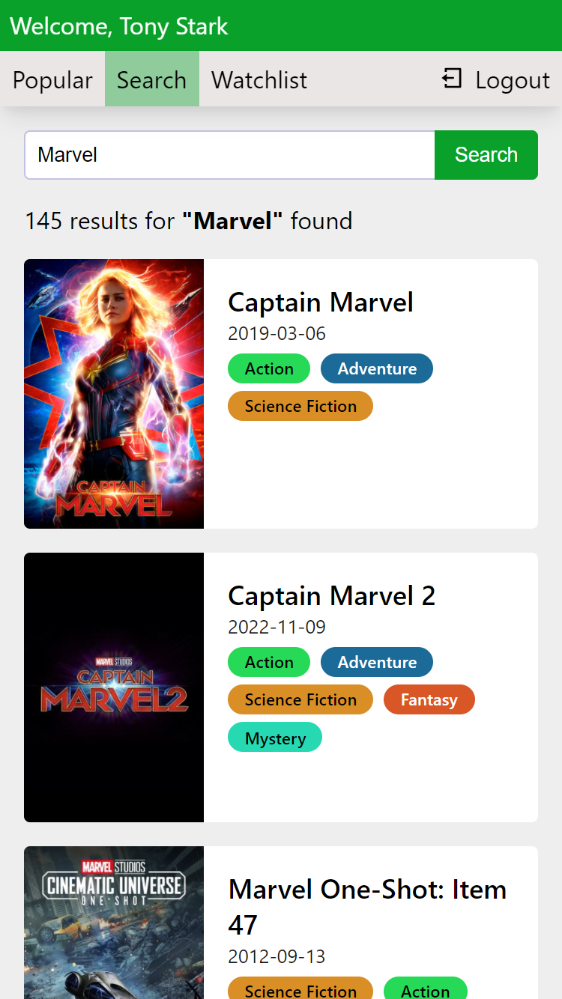
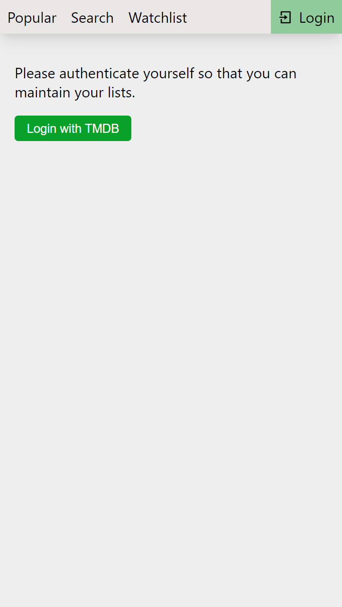
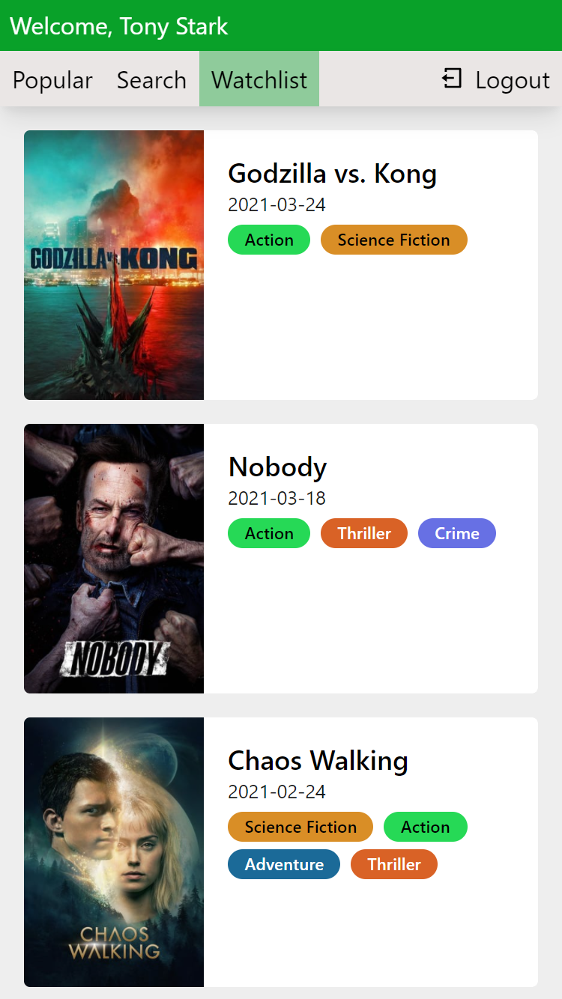
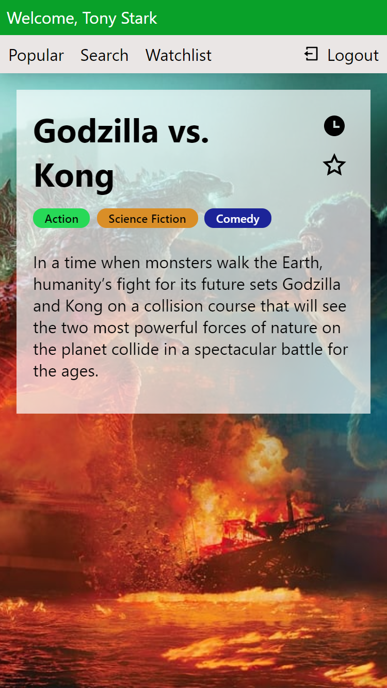
